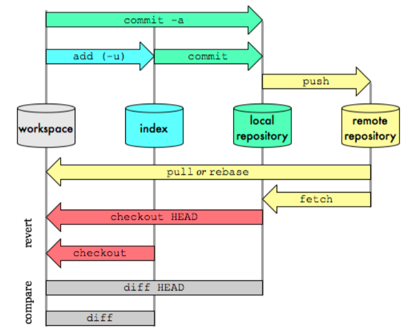

# Git - Mémo fonctionnement

## Commandes de base 

|git command|action|
|-----------------------------|--------------|
|`init`|This command initialises the directory where it is executed as a Git project.Concretely, this will create a hidden ".git" directory containing all the necessary files for Git to function and to follow the modifications made inside root directory|
|`status`|Displays files with differences between indexes and HEADs, those with differences between the working directory and the index as well as non-tracked files|
|`branch`|List, create or delete a branch.|
|`checkout` |Allows you to move from one branch to another (and many other things)|
|`checkout -b new_branch`   | Create and move to branch|
| `checkout -- .` | Revenir sur une version précédente de la branche|
|`checkout 1eab2` | Revenir à un commit spécifique|
|`revert ID`| Revert (créer un nouveau commit qui réapplique uniquement les modifs du commit de l'ID )|
|`reset --hard` | Revenir totalement sur une version précédente de la branche **unsafe car supprime l'historique** 
git reset --hard means git reset --hard HEAD, i.e. don't change the branch but get rid of all local changes |
|`diff`|TODO|
|`remote -v`| Liste les différentes remotes|
|`push -u origin my_branch`|A shortcut, which doesn't depend on remembering the syntax for `git branch --set-upstream 1 is to do:`
|`push origin --delete branch_name`| delete a branch already pushed|
|`cherry-pick`| récupérer les modifs à partir d'un certain commits (sur une nouvelle branche)|

## Commiter des fichiers

|git command|action|
|-----------------------------|--------------|
|`add`|Adds files to the Git index (stage or cache are synonyms for this. When a file is added in the index, it will be "tracked" by Git.|
|`git add .` | Ajoute les nouveaux fichiers et les fichiers modifiés (**sans tenir compte des fichiers effacés**) |
|`git add -u`| Ajoute les fichiers modifiés et les fichiers supprimés  (**sans tenir compte des nouveaux fichiers**)|
|`git add -A`| Ajoute l'ensemble des fichiers : modifiés, nouveaux fichiers et fichiers supprimés (mix de `git add .` et `git add -u`)| 
|`commit`| Saves the index to a new commit with a message describing the applied changes (log).|

## Checkout

When you checkout a branch, it changes HEAD to point to the new branch ref, populates your index with the snapshot of that commit, then copies the contents of the index into your working Directory.

## Que se passe t'il dans la plomberie interne de Git lorsqu'on commit 

When you run git commit, Git creates a new commit and moves the branch that HEAD points to up to it. 

## Schéma fonctionnement basique



Pour rappel, les fichiers passent par 3 "étapes" :

- **Espace de travail** (fichiers pas encore "addés"), = image bac à sable (sandbox) => appelé le Work tree ou Working directory, c'est l'ensemble des fichiers 
- **Index** (ou staging area) (fichiers "addés" mais pas "commités"), c'est ICI que se prépare les futurs commit
- **Le (local) repository** HEAD (fichiers "commités")

## HEAD , késako ?
`HEAD`
Référence vers le dernier commit de la branche courante


## Remote origin, késako ?
Ajouter une remote (le nom "origin" est choisi par convention)
`git remote add origin https://github.com/{username}/{projectname}.git`


## Jean-Michel Cas-Pratique : 

#### Annuler l'ajout d'un fichier à la staging area avant un commit
```
git reset jauraispasdulajouter.txt 
```
=> tout retirer de la staging area = `git reset`

#### Je suis un boulet et je veux annuler mon dernier commit 

```
git commit -m "Waw ça marche cool !"
# en fait j'ai fait de la merde 
# j'enlève le dernier commit et ça me remet tout mes fichiers commit en unstaged
git reset HEAD~
git add monSuperCode.pouet
git commit -m "ça marche vraiment"
```

#### Je veux juste changer mon message de commit car je suis un perfectioniste
```
git commit --ammend
```

#### Quand on crée une branche et qu'on la publie vers l'origin (remote)

```
# ... the first time that you push that branch. 
# Or, to push to the current branch to a branch of the same name (handy for an alias):
git push -u origin HEAD
```

## Liens en vrac, la farfouille du Git
* https://onlywei.github.io/explain-git-with-d3
* https://git-school.github.io/visualizing-git/
* prés. méthodes retours arrières https://www.youtube.com/watch?v=RIYrfkZjWmA
* https://marklodato.github.io/visual-git-guide/index-en.html
* https://www.git-tower.com/blog/git-cheat-sheet/
* https://dev.to/sublimegeek/git-staging-area-explained-like-im-five-1anh
* https://git-scm.com/book/en/v2/Git-Basics-Recording-Changes-to-the-Repository
* https://ahhda.github.io/git/architecture/2020/04/19/git-internal-architecture.html
* https://stackoverflow.com/questions/927358/how-do-i-undo-the-most-recent-local-commits-in-git
* https://stackoverflow.com/questions/2530060/in-plain-english-what-does-git-reset-do
* https://stackoverflow.com/questions/2304087/what-is-head-in-git
* https://stackoverflow.com/questions/2221658/whats-the-difference-between-head-and-head-in-git/12527561

